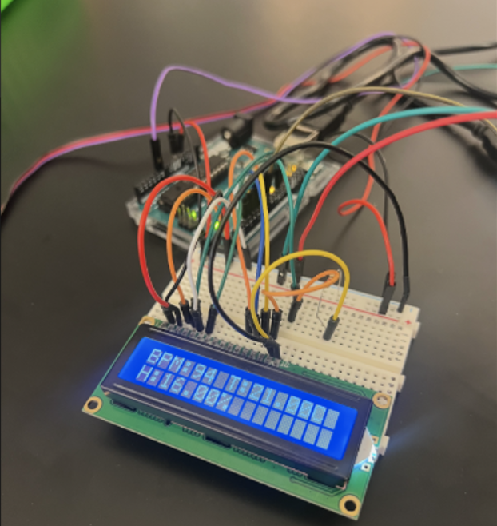
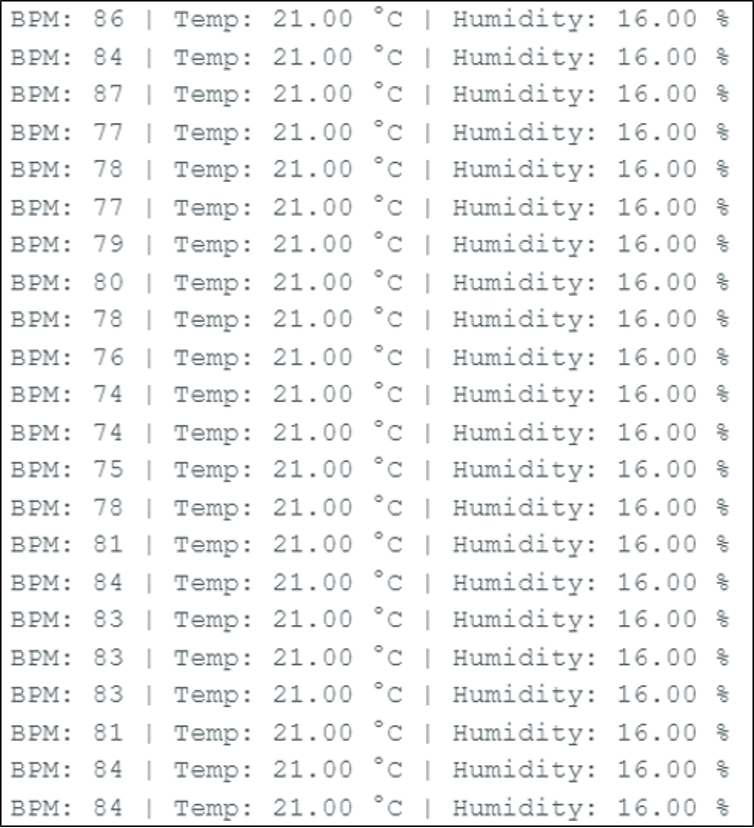

# Vital Signs Monitor — Arduino

A low-cost multi-parameter patient monitoring system built on Arduino, integrating 
PPG-based heart rate sensing with environmental humidity monitoring. Designed to 
address the gap in home care monitoring where physiological and environmental data 
are rarely tracked together.

---

## My Contributions

- Designed and programmed the Arduino software
- Wired and integrated the hardware prototype
- Implemented real-time sensor acquisition and LCD output
- Developed sensor fault detection using NaN validation
- Collaborated with teammates who completed the background research and report

## Clinical Motivation

Many respiratory and cardiovascular patients — including those with asthma, COPD, 
and heart disease — are affected by both their physiological state AND their 
environment. High humidity worsens breathing difficulties. Elevated heart rate 
signals physiological stress. Most low-cost home monitors track one or the other. 
This system tracks both simultaneously.

---

## Hardware

| Component | Purpose |
|---|---|
| Arduino Uno | Microcontroller |
| Pulse Sensor | PPG-based heart rate detection |
| DHT11 | Humidity and temperature sensing |
| 16x2 LCD Display | Real-time data output |

---

## What It Does

- Reads heart rate continuously via photoplethysmography (PPG)
- Reads ambient humidity and temperature via DHT11
- Displays real-time BPM, temperature, and humidity on LCD
- Outputs continuous data stream to serial monitor for logging
- Detects and displays sensor errors automatically

---

## How to Run

1. Wire components to Arduino per pin definitions in code
2. Install libraries: LiquidCrystal, DHT, PulseSensorPlayground
3. Upload vital_signs_monitor.ino via Arduino IDE
4. Open Serial Monitor at 9600 baud to view the live data stream

---

## Sample Output

LCD Display: BPM, temperature, and humidity readings shown in real time

Serial Monitor Output:

---

## Libraries Used

- LiquidCrystal — LCD display control
- DHT — humidity and temperature sensor
- PulseSensorPlayground — PPG heart rate processing

---

## Requirements
Arduino IDE 1.8 or later. Arduino Uno or compatible board.
